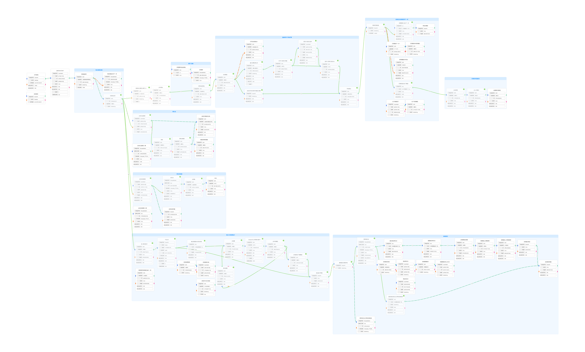

<!-- markdownlint-disable MD033 MD041 -->

MaaGBP基于MaaPracticeBoilerplate开发，使用MaaPipelineEditor进行流水线开发。感谢各位开发者的共享！

目标是实现邦邦手游《BanG Dream! 少女乐团派对！》（Girls Band Party简称GBP）的每日任务自由，仅使用游戏自带的AUTO功能进行打歌。

目前进度为：pipeline完善中...

待完成：  

等待打歌完成也可以加识别 
（待确认）点击获得报酬的ok，疑似也能点到升级的ok。（260314有升级，但是日志截图被后续识别覆盖了（大概能留下18条）待下次升级确认）。大概率现流程可以覆盖升级后的ok按钮。 
新增备选流程：不管剩余体力，仅打歌两次清20体就撤。（省时间） 

### 20260314记录

完善了：

#### 总体流程

修改为：点tap to start-等待15秒-判断首登-判断主页-后续流程

#### 打歌流程

解决了报酬界面会识别到没亮的‘下一步’按钮问题

##### 修改详情：

每日首登流程独立出来，要么首登点下一步，要么识别到‘等级’字样，进入主页。
打完歌后右下角的确定，会在领取报酬的界面被识别到。所以加了and颜色识别，按钮亮了才识别。

当前版本流程图如下

  

### 20260313记录

完善了：

#### 总体流程

等待登录的node，改为15秒+OCR

#### 每日抽卡流程

增加第一个节点的识别‘招募’

##### 修改详情：

等待登录中node，由单纯的等待15秒 改为识别‘登录游戏获得奖励’字样。确保不提前进入循环
星石商店无红点node，勿开了inverse，已关 

### 20260312记录

完善了：

#### 打歌流程

添加完成后 可能出现的ok按钮点击node

#### 每日抽卡流程

每日抽卡识别逻辑优化

#### 每周星石流程

优化每周星石的红点判定流程

#### 总体流程

每周星石 合并到 每日抽卡流程后

##### 修改详情：

- 修改等待登录参数为pre_delay，方便监控窗口看名称

- 打歌完成后，添加 获得报酬点击中间ok按钮节点

- 每日免费抽卡 识别条件失效：有新池子时，变成了‘1人星5确定’。所以更改为 直接点进去判断是否完成每日抽卡 
点击条件也需要改 从单一识别到免费二字，添加and 非今日已完成（已作废，修改见下行） 
今日已完成的inverse参数 无法传递到上一级（每次免费抽卡还有次数node）。所以换成颜色亮度（颜色）识别 
抽卡后的skip改为点4次，可过掉4星new卡界面 顺利进入下一个node 

- 每周星石的判定红点，不一定准确，添加了星星红点 和 星石商店红点的判断 
所有任务结束 判定条件：条件一、菜单无红点。条件二、菜单有红点&星石商店无红点。

- 因为游戏主页无法判断是否完成每日抽卡，需要进入抽卡界面确认，即无法结束流程。所以 移动每周星石至每日抽卡后

### 20260311记录

完善了：

#### 登录流程

单独抽取出 等待登录中 模块，方便调试

#### 每日首登流程

每日首登的下一步按钮点击，修复逻辑（识别到点击10次->登录完成后进行识别 重复）

#### 打歌流程

判断体力大等于10，修改为正则判断 
修复选中十倍体力点ok的 逻辑链：点ok后开始演出 
打完歌后，右下确定，post_freeze时间由3000减少为2000 

#### 每日抽卡流程

每日抽卡界面下拉操作 逻辑优化 
添加逻辑链：若没有识别到免费，则返回 

#### 总体流程

添加任务执行完毕模块，方便流水线结束 

ToT： 
发现MaaPipelineEditor（1.2.3版本）的bug：不能改变分组的颜色，否则会随机抽选一个node丢失 并且卡死

### 20260310记录

实现了：

##### 打开游戏、点击Tap To Start

##### 每日首次登录回主页

当前仅识别‘下一步’按钮 

##### 消耗体力

识别体力十位数 若为1或者2 则进行演出 
（待完善）仅识别‘自由演出’按钮，未做活动按钮识别 
‘自动演出 关’点击 改为开 
十倍体力，识别‘最大消费还’五个字 
等待120秒auto完成。 
完成后，’下一步‘和’确定‘同时找，同时点。 
打歌完成后，点确定-菜单-跳过-屏幕中间跳过，回主页。 

##### 领礼包

礼包按钮 右上角有红点则点进去-若显示’没有可领取的礼物‘则返回。否则点’键领取‘-确定-再点确定(-此时显示’没有可领取的礼物‘) 

##### 领任务奖励

右上角有红点 循环：“点红点-点领取-点ok”。直到找不到红点，点左上角返回 

##### 每日3次免费抽卡

若有’次免费‘，进入抽卡-左侧下滑3下-点免费-点招募-点SKIP两次-点中间确定 
先判断是否有’免费‘（进入第二次抽卡），有则进入招募-点SKIP两次的流程。 
否则点确定（3次抽完）-点左上角返回 

##### 每周星石

菜单有红点-星石商店和红点-超值组合和红点-免费按钮-领取按钮-已领取按钮-左上角返回 
 

