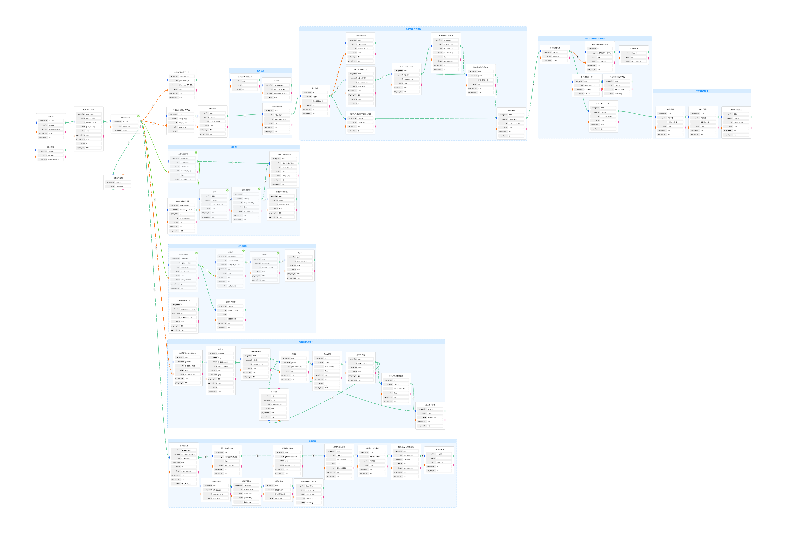

<!-- markdownlint-disable MD033 MD041 -->

MaaGBP基于MaaPracticeBoilerplate开发，使用MaaPipelineEditor进行流水线开发。感谢各位开发者的共享！

目标是实现邦邦手游《BanG Dream! 少女乐团派对！》（Girls Band Party简称GBP）的每日任务自由，仅使用游戏自带的AUTO功能进行打歌。

20260311记录 

#### 登录流程

单独抽取出 等待登录中 模块，方便调试

#### 每日首登流程

每日首登的下一步按钮点击，修复逻辑（识别到点击10次->登录完成后进行识别 重复）

#### 打歌流程

判断体力大等于10，修改为正则判断 
修复选中十倍体力点ok的 逻辑链：点ok后开始演出 
打完歌后，右下确定，post_freeze时间由3000减少为2000 

#### 每日抽卡流程

每日抽卡界面下拉操作 逻辑优化 
添加逻辑链：若没有识别到免费，则返回 

#### 总体流程

添加任务执行完毕模块，方便流水线结束 

ToT： 
发现MaaPipelineEditor的bug：不能改变分组的颜色，否则会随机抽选一个node丢失 并且卡死

当前版本流程图如下

  

20260310记录 
实现了：

##### 打开游戏、点击Tap To Start

##### 每日首次登录回主页

当前仅识别‘下一步’按钮 

##### 消耗体力

识别体力十位数 若为1或者2 则进行演出 
（待完善）仅识别‘自由演出’按钮，未做活动按钮识别 
‘自动演出 关’点击 改为开 
十倍体力，识别‘最大消费还’五个字 
等待120秒auto完成。 
完成后，’下一步‘和’确定‘同时找，同时点。 
打歌完成后，点确定-菜单-跳过-屏幕中间跳过，回主页。 

##### 领礼包

礼包按钮 右上角有红点则点进去-若显示’没有可领取的礼物‘则返回。否则点’键领取‘-确定-再点确定(-此时显示’没有可领取的礼物‘) 

##### 领任务奖励

右上角有红点 循环：“点红点-点领取-点ok”。直到找不到红点，点左上角返回 

##### 每日3次免费抽卡

若有’次免费‘，进入抽卡-左侧下滑3下-点免费-点招募-点SKIP两次-点中间确定 
先判断是否有’免费‘（进入第二次抽卡），有则进入招募-点SKIP两次的流程。 
否则点确定（3次抽完）-点左上角返回 

##### 每周星石

菜单有红点-星石商店和红点-超值组合和红点-免费按钮-领取按钮-已领取按钮-左上角返回 
 

